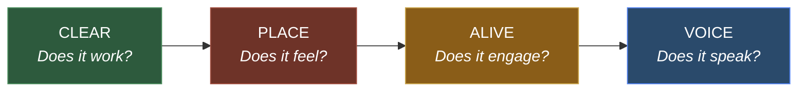
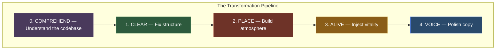

# Agentic Design Engineering

**Transform generic UIs into intentional, inhabited digital places.**

Most AI-built interfaces look the same. Rounded corners, neutral grays, tidy rows of cards. Competent, functional, forgettable. The internet is becoming an office park — every app a different floor of the same building.

Agentic Design Engineering is a structured system for changing that. Four interconnected frameworks — **CLEAR**, **PLACE**, **ALIVE**, **VOICE** — that any AI agent can apply to turn default-looking interfaces into spaces that feel crafted, alive, and distinctly human.

This isn't a design system. It's a design *philosophy* with teeth — actionable agent instructions, repair procedures, iteration loops, and evaluation criteria that produce measurably different results.

---

## Installation

### Claude Code

```bash
/plugin marketplace add akshansh/agentic-design-engineering
/plugin install agentic-design-engineering
```

Then use slash commands: `/ade:clear`, `/ade:place`, `/ade:alive`, `/ade:voice`, `/ade:audit`, `/ade:transform`

### OpenAI Codex (manual install)

> Codex's third-party plugin marketplace is not yet public. For now, install manually:

**Option A — Clone into Codex plugins:**

```bash
git clone https://github.com/akshansh/agentic-design-engineering.git
cp -R agentic-design-engineering/codex/agentic-design-engineering ~/.codex/plugins/agentic-design-engineering
```

**Option B — Repo-scoped (for your project):**

Clone this repo, and Codex will discover the plugin via `.agents/plugins/marketplace.json` when you work inside the repo.

Then use skills: `$ade-clear`, `$ade-place`, `$ade-alive`, `$ade-voice`, `$ade-audit`, `$ade-transform`

---

## The Four Frameworks



### CLEAR — Structure & Accessibility

*"Before anything else, the interface must be usable."*

Audits and repairs five dimensions: **C**opy, **L**ayout, **E**mphasis, **A**ccessibility, **R**eward. Accessibility issues are fixed first, always. Score target: 40/50. Context-branched for 8 product types — from emergency medical to educational platforms.

Rooted in: Cognitive Load Theory (Sweller), Gestalt Principles, WCAG 2.1, Flow Theory (Csikszentmihalyi)

### PLACE — Atmosphere & Art Direction

*"Every application inhabits a place. Your job is to discover which place, then build it."*

Transforms generic interfaces into inhabited spaces through physical metaphors — a boardroom with mahogany warmth, a workshop with industrial grit, a garden with organic softness. Real materials. Real light. Real temperature.

Inspired by: "Build Places, Not Products" (Lucas Crespo), Cora's art direction at Every

### ALIVE — Interactivity & Game Design Thinking

*"You can take almost anything, and looking at it the right way, make it a fascinating interactive experience." — Will Wright*

Injects vitality through micro-interactions, physics-based animations, discovery layers, and **required easter eggs** — the creator's hidden signature in the work. Inspired by Warren Robinett hiding his name inside Atari's Adventure in 1979.

Rooted in: Will Wright's MasterClass on Game Design, MDA Framework, Csikszentmihalyi's Flow Theory

### VOICE — Intentional Communication

*"Simplification is kindness. Every unnecessary word is a tiny cruelty."*

Reviews and rewrites UI copy to sound intentional — warm partnership, purpose before action, compassionate errors, metaphor language. Now includes a dedicated auditor for scoring and supports custom voice profiles. Scope: UI copy only.

---

## How They Work Together



**The order matters:** CLEAR before PLACE (can't build atmosphere on a broken layout). PLACE before ALIVE (can't animate elements without materiality). ALIVE before VOICE (can't write metaphor copy before the metaphor exists). Each framework gates the next.

---

## Commands Reference

| Action | Claude Code | Codex |
|--------|-------------|-------|
| Audit + repair UI structure | `/ade:clear` | `$ade-clear` |
| Transform atmosphere with metaphor | `/ade:place` | `$ade-place` |
| Inject physics, discovery, easter egg | `/ade:alive` | `$ade-alive` |
| Rewrite copy with warmth | `/ade:voice` | `$ade-voice` |
| Score all frameworks (read-only) | `/ade:audit` | `$ade-audit` |
| Full pipeline: CLEAR → PLACE → ALIVE → VOICE | `/ade:transform` | `$ade-transform` |

---

## What's New in v2.0

### Step 0: Codebase Comprehension
Every skill now begins by understanding what the codebase IS — domain, user persona, emotional weight, physical analog — before evaluating or transforming anything. The agent builds a **Product Portrait** that feeds all downstream decisions.

### Autonomous Mode
Run `/ade:transform` with "surprise me" or `--auto` and the agent makes all decisions independently — including metaphor selection via a 5-criteria scoring rubric. All quality gates still apply.

### Before/After Scoring
Every framework now runs its auditor at start AND end, producing delta tables that prove the transformation worked. No more "trust me, it's better."

### VOICE Auditor + Full Audit Coverage
VOICE now has its own auditor agent. `/ade:audit` scores all four frameworks — combined score out of /200.

### Error Recovery
Gate failures now have a 2-retry cap with per-framework fallback strategies. The agent won't loop forever — it documents what it couldn't fix and moves on.

### Structured Handoffs
CLEAR→PLACE→ALIVE→VOICE data contracts ensure clean context flow between frameworks.

---

## The Agents

Ten specialized agents power the framework skills:

| Agent | Role |
|-------|------|
| `codebase-comprehender` | Scans project structure to build a Product Portrait before any evaluation begins |
| `clear-auditor` | Evaluates UI against CLEAR, returns scored violations with file:line references |
| `place-auditor` | Evaluates atmosphere, returns diagnostics + physics profile for ALIVE |
| `alive-auditor` | Evaluates interactivity, maps dead spots, verifies easter egg exists |
| `voice-auditor` | Evaluates UI copy against 7 voice principles, returns scored findings |
| `metaphor-discoverer` | Suggests 3 ranked metaphors with scoring rubric — user picks or delegates |
| `atmosphere-builder` | Generates scoped CSS atmosphere layers from chosen metaphor + materials |
| `vitality-injector` | Scans code for dead spots, produces minimal physics-based patches |
| `voice-writer` | Reviews UI copy, rewrites generic text with warmth and purpose. Supports custom voice profiles |

In Claude Code, these run as dedicated agents. In Codex, they're converted to skills (e.g., `$clear-auditor`).

---

## Decision Logging

Every execution creates a dated decision log in the project's `ade_docs/` directory. Each log records: Product Portrait, metaphor chosen, materials, physics profile, copy rewrites, easter egg planted, before/after scores with deltas, cross-framework handoff data, gate pass/fail status, and files modified. What gets decided gets documented.

---

## Repository Structure

```
agentic-design-engineering/
│
├── plugins/                              # Claude Code plugin
│   └── agentic-design-engineering/
│       ├── .claude-plugin/plugin.json    # Claude Code manifest
│       ├── AGENTS.md                     # Agent registry + compliance rules
│       ├── CLAUDE.md                     # Quick reference
│       ├── README.md                     # Plugin documentation
│       ├── agents/
│       │   ├── analysis/                 # 1 comprehension agent
│       │   ├── review/                   # 4 auditor agents
│       │   ├── design/                   # 3 builder agents
│       │   └── voice/                    # 1 voice agent
│       ├── skills/
│       │   ├── shared/                   # Step 0 comprehension + handoff schema
│       │   ├── ade-clear/                # + references/clear-framework.md
│       │   ├── ade-place/                # + references/place-framework.md
│       │   ├── ade-alive/                # + references/alive-framework.md
│       │   ├── ade-voice/                # + references/voice-framework.md
│       │   ├── ade-audit/
│       │   └── ade-transform/
│       └── docs/                         # Decision log template
│
├── codex/                                # OpenAI Codex plugin
│   └── agentic-design-engineering/
│       ├── .codex-plugin/plugin.json     # Codex manifest
│       ├── AGENTS.md                     # Codex project instructions
│       ├── skills/
│       │   ├── shared/                   # Step 0 comprehension + handoff schema
│       │   ├── ade-clear/                # 6 framework skills (adapted)
│       │   ├── ade-place/                #   + references/
│       │   ├── ade-alive/
│       │   ├── ade-voice/
│       │   ├── ade-audit/
│       │   ├── ade-transform/
│       │   ├── clear-auditor/            # 9 specialist skills
│       │   ├── place-auditor/
│       │   ├── alive-auditor/
│       │   ├── voice-auditor/            # NEW
│       │   ├── codebase-comprehender/    # NEW
│       │   ├── metaphor-discoverer/
│       │   ├── atmosphere-builder/
│       │   ├── vitality-injector/
│       │   └── akshansh-voice/           # (voice-writer)
│       └── docs/                         # Decision log template
│
├── .claude-plugin/marketplace.json       # Claude Code marketplace entry
├── .agents/plugins/marketplace.json      # Codex marketplace entry
├── .gitignore
├── LICENSE                               # MIT
└── README.md                             # This file
```

---

## The Origin Story

This started with a meeting archive. Venus Remedies had 94 management meetings spanning 6 years — institutional memory trapped in PDFs. The app built to browse them worked perfectly. And felt like nothing.

The question that changed everything: *What if this login page wasn't a form — but a heavy wooden door to a private boardroom?*

Five design iterations later, the app had mahogany atmosphere, brass accents, candlelight warmth, and a keyhole ornament on the login page. It felt like entering institutional memory. Not viewing it.

The frameworks built to get there became Agentic Design Engineering.

---

## Inspired By

- **[Compound Engineering](https://github.com/EveryInc/compound-engineering-plugin)** by Kieran Klaassen at Every — the model for plugin architecture and agentic workflows
- **["Build Places, Not Products"](https://every.to/source-code/build-places-not-products)** by Lucas Crespo — the philosophy that software should feel like somewhere you want to stay
- **Will Wright's MasterClass on Game Design** — game loops, agency, emergence, and the idea that simple rules create complex, surprising outcomes
- **Warren Robinett's Adventure (1979)** — the first easter egg in any video game, and the inspiration for ALIVE's hidden fingerprint requirement
- **Ready Player One** by Ernest Cline — hidden layers that reward the deeply curious

---

## Author

**Akshansh Chaudhary** — [akshansh.net](https://akshansh.net)

ED & CTO at Venus Remedies. Parsons School of Design + BITS Pilani. Building bridges between traditional industries and human-centered technology.

*"Simplification is kindness. Structure creates clarity. Purpose drives action."*

Learn. Share. Repeat.

---

## License

MIT — Use it. Break it. Make it better. Build places, not products.
