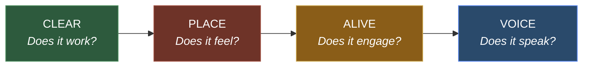
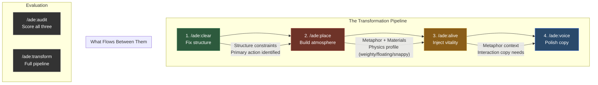

# Agentic Design Engineering

**Transform generic UIs into intentional, inhabited digital places.**

Most AI-built interfaces look the same. Rounded corners, neutral grays, tidy rows of cards. Competent, functional, forgettable. The internet is becoming an office park — every app a different floor of the same building.

Agentic Design Engineering is a structured system for changing that. Four interconnected frameworks — **CLEAR**, **PLACE**, **ALIVE**, **VOICE** — that any AI agent can apply to turn default-looking interfaces into spaces that feel crafted, alive, and distinctly human.

This isn't a design system. It's a design *philosophy* with teeth — actionable agent instructions, repair procedures, iteration loops, and evaluation criteria that produce measurably different results.

---

## The Problem

Ask any AI to build a dashboard and you get: sidebar navigation, metric cards, data table, rounded corners, neutral palette. Ask it to build a login page and you get: centered card, email field, password field, blue button. Every time.

This happens because AI optimizes for the statistical median. "Clean and modern" converges to the same 50 patterns. Design systems ship shared defaults that become shared outcomes. The result is functional — and forgettable.

**The antidote is specificity of metaphor.** When you say "this login page is a heavy wooden door to a private boardroom," every design decision becomes obvious — and unique. The password field becomes a guest book signature. The button becomes a door handle. The background becomes dark wood paneling lit by a desk lamp.

No two apps that start from different metaphors will ever look the same.

---

## The Four Frameworks



### CLEAR — Structure & Accessibility

*"Before anything else, the interface must be usable."*

CLEAR audits and repairs five dimensions of UI structure:

| Dimension | What It Checks |
|-----------|---------------|
| **C**opy | Active voice, compassionate errors, helpful empty states |
| **L**ayout | Spacing system, visual hierarchy, Gestalt grouping |
| **E**mphasis | Exactly ONE primary action per viewport |
| **A**ccessibility | Keyboard nav, contrast ≥ 4.5:1, focus indicators, 44px targets |
| **R**eward | Loading states, success feedback, inline errors |

CLEAR doesn't just evaluate — it **repairs**. Each violation has a specific fix procedure. Accessibility issues are fixed first, always. Score target: **40/50**.

**Rooted in:** Cognitive Load Theory (Sweller), Gestalt Principles, WCAG 2.1, Flow Theory (Csikszentmihalyi)

---

### PLACE — Atmosphere & Art Direction

*"Every application inhabits a place. Your job is to discover which place, then build it."*

PLACE transforms generic interfaces into inhabited spaces through five dimensions:

| Dimension | What It Creates |
|-----------|----------------|
| **P**hysical Metaphor | A specific real-world place the UI inhabits |
| **L**ighting & Atmosphere | CSS-generated light sources, depth, vignette, texture |
| **A**nimation as Physics | Motion with weight, inertia, spring tension |
| **C**olor as Material | Colors derived from physical materials, not arbitrary palettes |
| **E**nacted Typography | Fonts with character, copy that speaks the metaphor's language |

The process: gather visual references → define the feeling → name the place → map every UI element to a physical analog → build atmosphere in 5 CSS layers → **iterate 5 times** with screenshots.

The first version is never the design. It's the scaffolding. The design emerges through iteration.

**Inspired by:** "Build Places, Not Products" (Lucas Crespo), Cora's art direction at Every, Not Boring Camera

---

### ALIVE — Interactivity & Game Design Thinking

*"You can take almost anything, and looking at it the right way, make it a fascinating interactive experience." — Will Wright*

ALIVE injects vitality through five dimensions:

| Dimension | What It Adds |
|-----------|-------------|
| **A**gency & Affordance | Elements respond before contact, multiple interaction paths |
| **L**oops & Feedback | Every action acknowledged, spring physics, fun failure states |
| **I**nvitation & Discovery | Progressive reveal, power-user shortcuts, hidden depth |
| **V**itality & Physics | Ambient motion, weight-matched animations, WebGL moments |
| **E**mergence & Surprise | Contextual milestones, data-driven insights, **required easter egg** |

**The Hidden Fingerprint:** Every product built with ALIVE must include at least one easter egg — the creator's signature in the work. Not gamification. Not badges. A genuine hidden layer that rewards curiosity. Inspired by Warren Robinett hiding his name inside Atari's Adventure in 1979 — the first easter egg in any video game.

**Rooted in:** Will Wright's MasterClass on Game Design, MDA Framework (Hunicke, LeBlanc, Zubek), Csikszentmihalyi's Flow Theory

---

### VOICE — Intentional Communication

*"Simplification is kindness. Every unnecessary word is a tiny cruelty."*

VOICE reviews and rewrites UI copy through seven principles:

| Principle | What It Means |
|-----------|--------------|
| Warm Partnership | "We" not "you" — colleague, not gatekeeper |
| Simplification | Cut until it hurts, add one word back |
| Purpose Before Action | Tell them WHY before asking WHAT |
| Guide Through Questions | "Which meeting?" not "Select a meeting" |
| Specific to Bigger Picture | "91 meetings in the archive" not "91 items" |
| Compassionate Errors | "That didn't match. Try again." not "Invalid password" |
| Metaphor Language | "Enter the archive" not "Log in" (if PLACE established a metaphor) |

Scope: UI copy only — button labels, error messages, empty states, loading text, tooltips. Warmth without bloat.

---

## How They Work Together



**The order matters:**
- You can't build atmosphere on a broken layout → **CLEAR before PLACE**
- You can't animate elements that don't have materiality → **PLACE before ALIVE**
- You can't write metaphor copy before the metaphor exists → **ALIVE before VOICE**

Each framework gates the next. If CLEAR scores below 40/50, PLACE won't run. Structure first. Always.

---

## Slash Commands

| Command | What It Does | When to Use |
|---------|-------------|-------------|
| `/ade:clear` | Audit + repair UI structure | Your UI has accessibility issues, layout problems, or missing feedback |
| `/ade:place` | Transform atmosphere with a physical metaphor | Your UI works but feels generic — "it could be any product" |
| `/ade:alive` | Inject physics, feedback loops, discovery, easter egg | Your UI has atmosphere but feels static — nothing moves, nothing surprises |
| `/ade:voice` | Rewrite copy with warmth and intention | Your buttons say "Submit," your errors say "Invalid," your empty states say nothing |
| `/ade:audit` | Score all frameworks without changing code | You want a baseline assessment before making changes |
| `/ade:transform` | Full pipeline: CLEAR → PLACE → ALIVE → VOICE | You want the complete transformation from generic to intentional |

---

## Who Is This For?

**Developers using AI to build interfaces** who are tired of every app looking the same. If you've ever looked at your AI-generated UI and thought "this works, but it doesn't feel like anything" — this is for you.

**Designers working with AI agents** who want to encode their taste into repeatable frameworks. Instead of manually art-directing every screen, these frameworks let agents apply your vision consistently.

**Product teams building distinctive products** where the experience IS the differentiator. When two tools solve the same problem equally well, the one that feels like a place wins.

**Solo builders** who care about craft. You don't need a design team to make something beautiful. You need a system that asks the right questions.

---

## The Agents

Seven specialized agents power the framework skills:

| Agent | Role |
|-------|------|
| `clear-auditor` | Evaluates UI against CLEAR, returns scored violations with file:line references |
| `place-auditor` | Evaluates atmosphere, returns diagnostics + physics profile for ALIVE |
| `alive-auditor` | Evaluates interactivity, maps dead spots, verifies easter egg exists |
| `metaphor-discoverer` | Suggests 3-5 physical metaphors from product domain — user picks |
| `atmosphere-builder` | Generates scoped CSS atmosphere layers from chosen metaphor + materials |
| `vitality-injector` | Scans code for dead spots, produces minimal physics-based patches |
| `akshansh-voice` | Reviews UI copy, rewrites generic text with warmth and purpose |

---

## Decision Logging

Every `/ade:*` execution creates a dated decision log in the project's `ade_docs/` directory:

```
ade_docs/
├── 2026-03-29-clear-audit.md
├── 2026-03-29-place-transformation.md
├── 2026-03-29-alive-injection.md
└── 2026-03-29-full-transform.md
```

Each log records: metaphor chosen, materials, physics profile, copy rewrites, easter egg planted, scores before and after, files modified. What gets decided gets documented.

---

## Installation

### Claude Code
```bash
claude plugin add akshansh/agentic-design-engineering
```

### Manual
Clone this repo and point your Claude Code settings to the plugin directory.

---

## Repository Structure

```
agentic-design-engineering/
└── plugins/agentic-design-engineering/
    ├── .claude-plugin/plugin.json     # Plugin manifest
    ├── AGENTS.md                      # Agent registry + compliance rules
    ├── CLAUDE.md                      # Quick reference
    ├── README.md                      # Plugin documentation
    ├── agents/
    │   ├── review/                    # 3 auditor agents (CLEAR, PLACE, ALIVE)
    │   ├── design/                    # 3 builder agents (metaphor, atmosphere, vitality)
    │   └── voice/                     # 1 voice agent
    ├── skills/
    │   ├── ade-clear/                 # /ade:clear skill + CLEAR v2 reference
    │   ├── ade-place/                 # /ade:place skill + PLACE reference
    │   ├── ade-alive/                 # /ade:alive skill + ALIVE reference
    │   ├── ade-voice/                 # /ade:voice skill + VOICE reference
    │   ├── ade-audit/                 # /ade:audit combined evaluation
    │   └── ade-transform/             # /ade:transform full pipeline
    └── docs/
        ├── README.md                  # Decision log documentation
        └── decision-log-template.md   # Template for execution logs
```

---

## The Origin Story

This started with a meeting archive. Venus Remedies had 94 management meetings spanning 6 years — institutional memory trapped in PDFs. The app built to browse them worked perfectly. And felt like nothing.

The question that changed everything: *What if this login page wasn't a form — but a heavy wooden door to a private boardroom?*

Five design iterations later, the app had mahogany atmosphere, brass accents, candlelight warmth, and a keyhole ornament on the login page. It felt like entering institutional memory. Not viewing it.

The frameworks built to get there became Agentic Design Engineering.

---

## Inspired By

- **[Compound Engineering](https://github.com/EveryInc/compound-engineering-plugin)** by Kieran Klaassen at Every — the model for plugin architecture and agentic workflows
- **["Build Places, Not Products"](https://every.to/source-code/build-places-not-products)** by Lucas Crespo — the philosophy that software should feel like somewhere you want to stay
- **Will Wright's MasterClass on Game Design** — game loops, agency, emergence, and the idea that simple rules create complex, surprising outcomes
- **Warren Robinett's Adventure (1979)** — the first easter egg in any video game, and the inspiration for ALIVE's hidden fingerprint requirement
- **Ready Player One** by Ernest Cline — hidden layers that reward the deeply curious

---

## Author

**Akshansh Chaudhary** — [akshansh.net](https://akshansh.net)

ED & CTO at Venus Remedies. Parsons School of Design + BITS Pilani. Building bridges between traditional industries and human-centered technology.

*"Simplification is kindness. Structure creates clarity. Purpose drives action."*

Learn. Share. Repeat.

---

## License

MIT — Use it. Break it. Make it better. Build places, not products.
